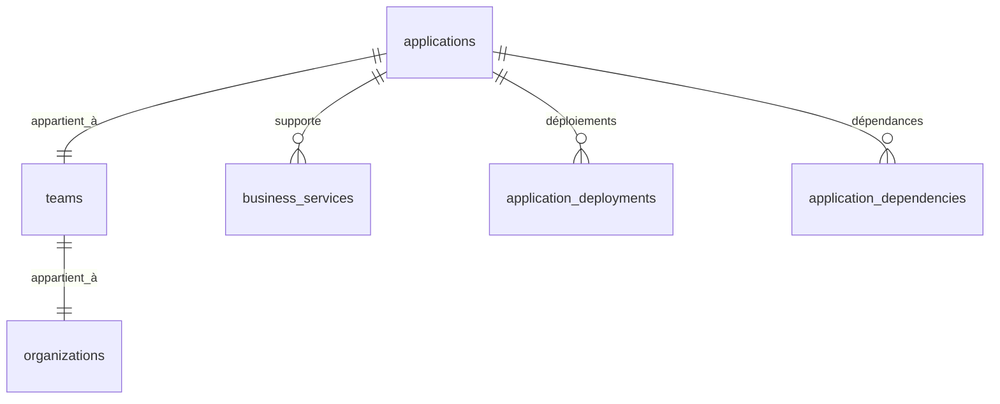

# 💻 Guide des Applications - Plateforme MSP

## 📋 Vue d'ensemble

Le module de **Gestion des Applications** permet aux équipes de cartographier, organiser et superviser toutes leurs applications techniques, en établissant des liens avec les services métiers et en centralisant la documentation technique.

## 🎯 Objectifs

- **Inventaire applicatif** : Catalogue complet des applications
- **Classification par type** : Organisation par typologie (Web, API, Mobile, etc.)
- **Stack technique** : Cartographie des technologies utilisées
- **Liaison métier** : Connexion avec les services business
- **Gestion des déploiements** : Suivi des environnements
- **Métriques et performance** : Supervision de la santé applicative

---

## 🚀 Fonctionnalités principales

### 1. **Création et gestion des applications**
- ✅ Formulaire complet avec types prédéfinis
- ✅ Classification par typologie (Web, API, Mobile, Database, etc.)
- ✅ Versioning et suivi des releases
- ✅ Liens vers repositories et documentation

### 2. **Stack technique avancée**
- ✅ **Technologies prédéfinies** : React, Node.js, PostgreSQL, Docker...
- ✅ **Ajout personnalisé** : Support technologies spécifiques
- ✅ **Badges visuels** : Affichage clair des stacks
- ✅ **Statistiques technologiques** : Analyse des usages

### 3. **Intégration avec services métiers**
- ✅ **Liaison bidirectionnelle** : Application ↔ Service métier
- ✅ **Mapping automatique** : Synchronisation des dépendances
- ✅ **Vue consolidée** : Impact business des applications
- ✅ **Criticité héritée** : Priorisation selon les services

### 4. **Gestion des déploiements**
- ✅ **Multi-environnements** : Dev, Staging, Production
- ✅ **Historique des déploiements** : Suivi chronologique
- ✅ **Statuts en temps réel** : État des environnements
- ✅ **Métriques de performance** : Uptime, réponse, erreurs

### 5. **Dashboard et analytiques**
- ✅ **Vue d'ensemble** : Métriques globales et applications récentes
- ✅ **Répartition par type** : Graphiques et statistiques
- ✅ **Technologies populaires** : Analyse des tendances
- ✅ **Santé globale** : Indicateurs de performance

---

## 🏗️ Architecture technique

### Structure des données

```typescript
interface Application {
  id: string;
  name: string;                     // Nom de l'application
  description: string;              // Description détaillée
  application_type: string;         // web, api, mobile, database...
  version: string;                  // Version actuelle
  team_id: string;                  // Équipe propriétaire
  technology_stack: string[];      // Technologies utilisées
  business_services: string[];     // Services métiers liés
  repository_url: string;          // URL du repository Git
  documentation_url: string;       // URL de la documentation
  metadata: Record<string, any>;   // Informations supplémentaires
}
```

### Relations base de données



### Types d'applications supportés

| Type | Description | Icône | Exemple |
|------|-------------|-------|---------|
| **Web** | Interface utilisateur web | 🌐 | React SPA, Vue.js App |
| **API** | Service backend/API REST | 🔌 | Node.js API, FastAPI |
| **Mobile** | Application mobile | 📱 | React Native, Flutter |
| **Database** | Base de données | 🗄️ | PostgreSQL, MongoDB |
| **Microservice** | Service distribué | ⚡ | Service mesh component |
| **Desktop** | Application de bureau | 💻 | Electron App, WPF |
| **Batch** | Traitement par lot | 🔄 | Cron jobs, ETL |
| **Integration** | Connecteur/Middleware | 🔗 | API Gateway, ESB |
| **Monitoring** | Surveillance | 📊 | Grafana, Prometheus |
| **Security** | Composant sécurité | 🔒 | Auth service, Firewall |

---

## 📱 Guide d'utilisation

### 1. **Accéder aux Applications**
```
Navigation → Applications → Applications
URL: /applications/applications
```

### 2. **Créer une nouvelle application**

#### Étape 1 : Informations de base
- **Nom** : Nom explicite de l'application (ex: "API Gateway Principal")
- **Description** : Description détaillée du rôle et fonctionnalités
- **Type d'application** : Sélection dans la liste prédéfinie
  - 🌐 **Web** : Applications frontend
  - 🔌 **API** : Services backend
  - 📱 **Mobile** : Apps mobile natives/hybrides
  - 🗄️ **Database** : Systèmes de données
  - ⚡ **Microservice** : Services distribués
- **Version** : Version actuelle (ex: "1.2.3")

#### Étape 2 : Stack technique
- **Technologies utilisées** : Sélection des technologies
  - **Frontend** : React, Vue.js, Angular, TypeScript...
  - **Backend** : Node.js, Python, Java, Go...
  - **Database** : PostgreSQL, MongoDB, Redis...
  - **Infrastructure** : Docker, Kubernetes, AWS...
- **Ajout personnalisé** : Technologies spécifiques non listées

#### Étape 3 : Services métiers
- **Liaison automatique** : Sélection des services métiers supportés
- **Impact business** : Compréhension de la criticité
- **Mapping bidirectionnel** : Synchronisation automatique

#### Étape 4 : Liens et documentation
- **Repository URL** : Lien vers le code source (GitHub, GitLab...)
- **Documentation URL** : Lien vers la doc technique
- **Métadonnées** : Informations supplémentaires en JSON

### 3. **Visualiser une application**

#### Vue d'ensemble
- 📊 **Informations générales** : Type, version, équipe
- 🔗 **Liens externes** : Repository, documentation
- 📈 **Métriques** : Uptime, performance, santé

#### Services métiers liés
- 📦 **Liste des services** utilisant cette application
- 🎯 **Criticité héritée** : Impact business
- 🔄 **Synchronisation** : Mise à jour automatique

#### Stack et technologies
- 🔧 **Technologies utilisées** : Badges par technologie
- 📊 **Statistiques** : Adoption dans l'équipe
- 🏗️ **Architecture** : Vue technique

#### Déploiements
- 🚀 **Environnements actifs** : Dev, Staging, Prod
- 📅 **Historique** : Chronologie des déploiements
- 📊 **Métriques** : Performance par environnement

---

## 📊 Dashboard et métriques

### Métriques principales

| Métrique | Description | Objectif |
|----------|-------------|----------|
| **Applications totales** | Nombre total d'applications | Croissance du patrimoine |
| **Déploiements actifs** | Environnements en ligne | Disponibilité des services |
| **Services métiers liés** | % apps connectées au business | 90% de couverture |
| **Santé globale** | % applications saines | 95% minimum |

### Répartitions et analyses

#### Par type d'application
- 🌐 **Web** : Applications frontend
- 🔌 **API** : Services backend
- 📱 **Mobile** : Apps mobile
- 🗄️ **Database** : Systèmes de données
- ⚡ **Microservices** : Architecture distribuée

#### Technologies populaires
- **Langages** : JavaScript, Python, Java, Go...
- **Frameworks** : React, Node.js, Spring Boot...
- **Infrastructure** : Docker, Kubernetes, AWS...
- **Databases** : PostgreSQL, MongoDB, Redis...

#### État de santé
- 🟢 **Sain** (>90%) : Applications performantes
- 🟡 **Attention** (70-90%) : Surveillance renforcée
- 🔴 **Critique** (<70%) : Intervention requise
- ⚪ **Inconnu** : Métriques non disponibles

---

## 🔧 Bonnes pratiques

### 1. **Nommage des applications**
```
✅ API Gateway Principal
✅ Interface Client Mobile
✅ Service de Notifications
✅ Base de Données Utilisateurs

❌ App1
❌ Backend
❌ DB
❌ Service
```

### 2. **Classification par type**
- **Web** : Interfaces utilisateur accessibles via navigateur
- **API** : Services exposant des endpoints REST/GraphQL
- **Mobile** : Applications natives ou hybrides pour smartphones
- **Database** : Systèmes de gestion de données
- **Microservice** : Services métier spécialisés et autonomes

### 3. **Gestion de la stack technique**
- **Exhaustive** : Inclure toutes les technologies significatives
- **Précise** : Spécifier les versions quand pertinent
- **Maintenue** : Mise à jour lors des évolutions
- **Standardisée** : Utiliser les noms officiels

### 4. **Liaison avec services métiers**
- **Mapping complet** : Chaque app doit servir un business
- **Criticité cohérente** : Apps critiques = services critiques
- **Documentation** : Expliquer les dépendances
- **Révision périodique** : Validation trimestrielle

### 5. **Documentation et liens**
- **Repository à jour** : Code source accessible
- **Documentation vivante** : Guides maintenus
- **Architecture claire** : Diagrammes et schémas
- **Contacts identifiés** : Responsables techniques

---

## 🎨 Personnalisation

### 1. **Types d'applications personnalisés**
```typescript
// Ajout de types spécifiques à votre organisation
const CUSTOM_APPLICATION_TYPES = [
  { value: 'iot', label: 'IoT Device', description: 'Dispositif connecté' },
  { value: 'ai', label: 'Intelligence Artificielle', description: 'Service IA/ML' },
  { value: 'blockchain', label: 'Blockchain', description: 'Application décentralisée' }
];
```

### 2. **Stack technique personnalisée**
```typescript
// Technologies spécifiques à votre contexte
const CUSTOM_TECHNOLOGIES = [
  'Framework Interne', 'API Propriétaire', 'Outil Spécialisé'
];
```

### 3. **Métadonnées organisationnelles**
```json
{
  "environment": "production",
  "cost_center": "IT001",
  "technical_lead": "john.doe@company.com",
  "security_level": "high",
  "compliance": ["GDPR", "SOX"],
  "monitoring": {
    "prometheus": true,
    "grafana_dashboard": "https://grafana.company.com/d/app123"
  }
}
```

---

## 🔒 Sécurité et permissions

### Contrôle d'accès
- **MSP Admin** : Accès complet toutes applications
- **Team Manager** : Applications de son équipe
- **Developer** : Applications assignées
- **Reader** : Lecture applications publiques

### RLS (Row Level Security)
```sql
-- Politique d'accès par équipe
CREATE POLICY "applications_team_access" 
ON applications FOR ALL 
USING (team_id = current_user_team_id());
```

---

## 🚀 Évolutions futures

### Phase 2 : Monitoring avancé
- 📈 **APM Integration** : New Relic, Datadog
- 🚨 **Alerting intelligent** : Seuils automatiques
- 📊 **Dashboards temps réel** : Métriques live

### Phase 3 : DevOps automation
- 🔄 **CI/CD Integration** : GitLab CI, Jenkins
- 🚀 **Déploiement automatique** : Infrastructure as Code
- 📝 **Documentation auto** : Génération depuis code

### Phase 4 : Intelligence applicative
- 🤖 **AI pour classification** : Type auto-détecté
- 📊 **Analytics prédictives** : Prévision de charge
- 🎯 **Recommandations** : Optimisation architecture

---

## 📞 Support et ressources

### Documentation technique
- **Types TypeScript** : `src/types/application.ts`
- **Hook principal** : `src/hooks/useApplications.ts`
- **Composants** : `src/components/applications/`
- **Page principale** : `src/pages/Applications.tsx`

### Intégrations
- **Services métiers** : Liaison bidirectionnelle
- **Équipes** : Gestion des permissions
- **Cloud Assets** : Mapping infrastructure

### Formation et support
- **Sessions d'onboarding** : Introduction au module
- **Documentation interactive** : Guides pas-à-pas
- **Support technique** : Équipe MSP disponible

---

## 📈 Métriques de succès

### Indicateurs clés
- **Couverture applicative** : >95% apps inventoriées
- **Liaison métier** : >90% apps connectées aux services
- **Documentation** : >80% apps avec liens repository
- **Adoption équipes** : Utilisation quotidienne

### Objectifs organisationnels
- ✅ **Visibilité totale** du patrimoine applicatif
- ✅ **Traçabilité** des dépendances métier-technique
- ✅ **Standardisation** des pratiques de développement
- ✅ **Optimisation** des ressources et technologies

---

## 🎉 Conclusion

Le système de **Gestion des Applications** fournit une vue technique complète et structurée de votre écosystème applicatif, permettant :

- ✅ **Cartographie exhaustive** de toutes les applications
- ✅ **Liaison métier-technique** claire et maintenue
- ✅ **Supervision centralisée** de la santé applicative
- ✅ **Optimisation technologique** basée sur les données
- ✅ **Documentation centralisée** de l'architecture

**Prêt à cartographier vos applications ? Commencez l'inventaire dès maintenant !** 🚀 