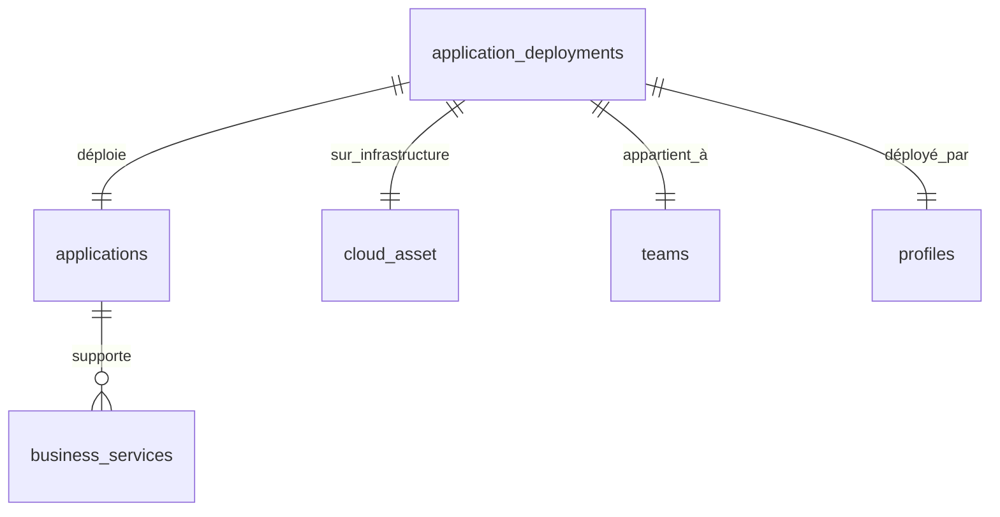
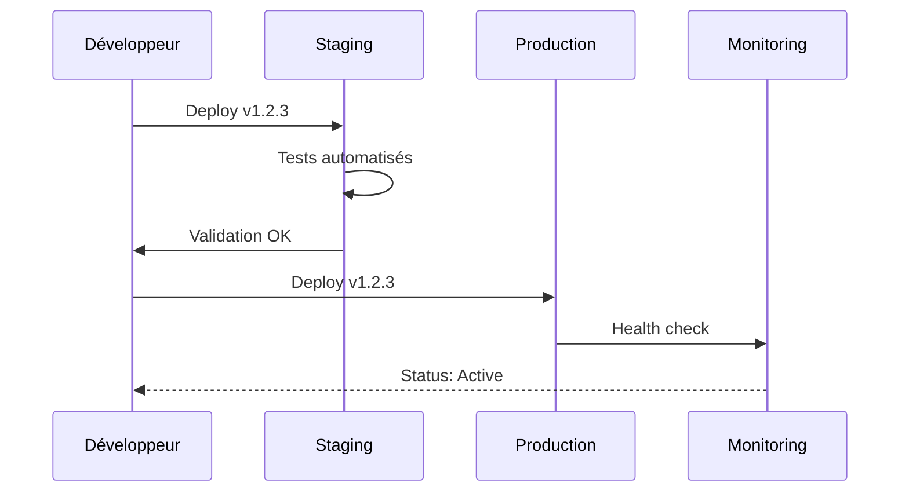

# 🚀 Guide des Déploiements - Plateforme MSP

## 📋 Vue d'ensemble

Le module de **Gestion des Déploiements** permet aux équipes de tracker, orchestrer et superviser tous les déploiements d'applications sur leur infrastructure cloud, offrant une visibilité complète du cycle de vie des releases.

## 🎯 Objectifs

- **Traçabilité complète** : Historique de tous les déploiements
- **Multi-environnements** : Dev, Staging, Production, Testing
- **Gestion des versions** : Suivi précis des releases
- **Monitoring continu** : Health checks et supervision
- **Liaison infrastructure** : Mapping avec les actifs cloud
- **Collaboration** : Workflow d'équipe pour les releases

---

## 🚀 Fonctionnalités principales

### 1. **Création et gestion des déploiements**
- ✅ **Formulaire avancé** : Configuration complète par onglets
- ✅ **Sélection d'actifs cloud** : Liaison avec l'infrastructure
- ✅ **Types de déploiement** : Manuel, automatisé, hotfix, rollback
- ✅ **Multi-environnements** : Development, Staging, Production

### 2. **Supervision et monitoring**
- ✅ **Health checks automatiques** : Vérification de l'état
- ✅ **Statuts temps réel** : Active, Failed, Pending, Maintenance
- ✅ **Métriques de performance** : Uptime, temps de déploiement
- ✅ **Alertes proactives** : Notifications en cas d'incident

### 3. **Gestion avancée des environnements**
- 🌐 **Production** : Environnement client final
- 🧪 **Staging** : Tests d'intégration et validation
- 🔧 **Development** : Développement et tests unitaires
- 🔍 **Testing** : Tests spécialisés et charge
- 🎯 **Demo** : Démonstrations client

### 4. **Interface de gestion complète**
- ✅ **Dashboard global** : Vue d'ensemble avec métriques
- ✅ **Filtrage avancé** : Par app, environnement, statut, dates
- ✅ **Actions rapides** : Start/Stop, Maintenance, Health Check
- ✅ **Vue détaillée** : Configuration et historique complets

---

## 🏗️ Architecture technique

### Structure des données

```typescript
interface ApplicationDeployment {
  id: string;
  application_id: string;           // Application déployée
  cloud_asset_id: string;          // Infrastructure cible
  environment_name: string;        // dev, staging, production...
  deployment_type: string;         // manual, automated, hotfix...
  status: string;                  // active, failed, pending...
  version: string;                 // Version déployée
  deployed_by: string;             // Qui a déployé
  deployment_date: string;         // Quand
  health_check_url: string;        // URL de vérification
  configuration: Record<string, any>; // Config spécifique
  metadata: Record<string, any>;   // Métadonnées
  team_id: string;                 // Équipe propriétaire
}
```

### Relations base de données



### Types de déploiement supportés

| Type | Description | Usage | Automatisation |
|------|-------------|-------|----------------|
| **Manual** | Déploiement manuel | Tests, premiers déploiements | Non |
| **Automated** | Via pipeline CI/CD | Production standard | Oui |
| **Hotfix** | Correction urgente | Incidents critiques | Partiellement |
| **Rollback** | Retour version précédente | En cas de problème | Oui |
| **Blue-Green** | Déploiement sans interruption | Production haute dispo | Oui |
| **Canary** | Déploiement progressif | Validation risquée | Oui |

---

## 📱 Guide d'utilisation

### 1. **Accéder aux Déploiements**

#### Vue globale
```
Navigation → Applications → Déploiements
URL: /applications/deployments
```

#### Vue par application
```
Applications → [Application] → Onglet "Déploiements"
```

### 2. **Créer un nouveau déploiement**

#### Étape 1 : Configuration de base
- **Application** : Sélection depuis la liste des applications de l'équipe
- **Actif cloud** : Infrastructure cible (serveurs, conteneurs, etc.)
- **Environnement** : 
  - 🔧 **Development** : Tests développeurs
  - 🧪 **Staging** : Validation pré-production
  - 🌐 **Production** : Environnement client
  - 🔍 **Testing** : Tests automatisés
  - 🎯 **Demo** : Démonstrations
- **Type de déploiement** : Manuel, automatisé, hotfix...
- **Version** : Version spécifique à déployer

#### Étape 2 : Configuration avancée
- **Health Check URL** : Point d'entrée pour vérifier l'état
- **Configuration technique** : Variables d'environnement, paramètres
  ```json
  {
    "NODE_ENV": "production",
    "DATABASE_URL": "postgresql://...",
    "API_KEY": "...",
    "MAX_CONNECTIONS": 100
  }
  ```

#### Étape 3 : Métadonnées
- **Tags** : Classification et organisation
- **Contacts** : Responsables techniques
- **Documentation** : Liens utiles
  ```json
  {
    "tags": ["critical", "backend"],
    "contact": "team@example.com",
    "documentation": "https://docs.example.com/deployment",
    "rollback_procedure": "https://wiki.example.com/rollback"
  }
  ```

### 3. **Gérer les déploiements existants**

#### Actions rapides disponibles
- 🟢 **Activer** : Démarrer un déploiement en attente
- ⏸️ **Désactiver** : Arrêter temporairement
- 🔧 **Maintenance** : Mode maintenance programmée
- 💓 **Health Check** : Vérification manuelle de l'état
- 🔄 **Rollback** : Retour version précédente

#### Filtrage avancé
- **Par application** : Focus sur une app spécifique
- **Par environnement** : Production, staging, etc.
- **Par statut** : Actif, échoué, en attente
- **Par période** : Déploiements récents ou historiques

---

## 📊 Dashboard et métriques

### Métriques principales

| Métrique | Description | Objectif | Impact |
|----------|-------------|----------|--------|
| **Déploiements totaux** | Nombre total ce mois | Vélocité équipe | Productivité |
| **Environnements actifs** | Nombre d'envs en ligne | Disponibilité | Service Level |
| **Déploiements récents** | 7 derniers jours | Activité | Cadence release |
| **Taux de succès** | % déploiements réussis | Qualité | Stabilité |

### Répartitions et analyses

#### Par environnement
- 🌐 **Production** : Environnements clients (stabilité max)
- 🧪 **Staging** : Validation pré-production (tests complets)
- 🔧 **Development** : Tests développeurs (rapidité)
- 🔍 **Testing** : Tests automatisés (couverture)

#### Par statut de santé
- 🟢 **Actif** (>90%) : Déploiements opérationnels
- 🟡 **Maintenance** : Opérations programmées
- 🔴 **Échoué** : Nécessitent intervention
- ⏳ **En attente** : En cours de déploiement

#### Tendances temporelles
- **Fréquence** : Nombre de déploiements par semaine
- **Durée moyenne** : Temps de déploiement
- **Taux d'échec** : Évolution de la qualité
- **Time to recovery** : Rapidité de résolution

---

## 🔧 Workflows et bonnes pratiques

### 1. **Cycle de vie standard**



### 2. **Stratégies de déploiement**

#### Déploiement Blue-Green
```
1. Nouveau code → Environnement Green (inactif)
2. Tests complets sur Green
3. Basculement du trafic Blue → Green
4. Ancien environnement Blue devient standby
```

#### Déploiement Canary
```
1. Déploiement sur 5% du trafic
2. Monitoring intensif
3. Si OK → 25% → 50% → 100%
4. Si KO → Rollback immédiat
```

### 3. **Gestion des incidents**

#### Procédure d'urgence
1. **Détection** : Alertes automatiques ou signalement
2. **Évaluation** : Impact business et technique
3. **Décision** : Rollback ou fix forward
4. **Action** : Exécution avec traçabilité
5. **Communication** : Notification équipes concernées
6. **Post-mortem** : Analyse et amélioration

#### Rollback automatique
- **Triggers** : Taux d'erreur > seuil, health check failed
- **Conditions** : Version précédente stable disponible
- **Process** : Automated rollback + notifications
- **Validation** : Health check post-rollback

---

## 🔗 Intégrations

### 1. **Avec les Applications**
- **Liaison bidirectionnelle** : App ↔ Déploiements
- **Métriques consolidées** : Performance globale
- **Vue unifiée** : Architecture technique complète

### 2. **Avec les Cloud Assets**
- **Mapping infrastructure** : Déploiements sur assets spécifiques
- **Optimisation ressources** : Utilisation des serveurs
- **Coûts** : Tracking des coûts par déploiement

### 3. **Avec les Services Métiers**
- **Impact business** : Déploiements affectant les services critiques
- **Planification** : Fenêtres de maintenance métier
- **Escalade** : Notification selon criticité

### 4. **CI/CD Pipeline (Future)**
```typescript
// Webhook pour déploiement automatique
const handleDeploymentWebhook = async (payload) => {
  await createDeployment({
    application_id: payload.app_id,
    cloud_asset_id: payload.target_server,
    environment_name: payload.environment,
    deployment_type: 'automated',
    version: payload.version,
    status: 'pending'
  });
};
```

---

## 🛡️ Sécurité et gouvernance

### Contrôle d'accès
- **MSP Admin** : Tous déploiements, tous environnements
- **Team Manager** : Déploiements de son équipe
- **Developer** : Création dev/staging, lecture prod
- **Reader** : Lecture seule sur environnements autorisés

### Audit et traçabilité
- **Qui** : Identification complète du déployeur
- **Quoi** : Version exacte et configuration
- **Quand** : Horodatage précis
- **Où** : Infrastructure cible détaillée
- **Pourquoi** : Métadonnées et contexte

### Validation et approbations
- **Pré-requis** : Tests passés, validation staging
- **Approbations** : Workflow selon environnement
- **Contraintes** : Fenêtres de maintenance autorisées

---

## 📈 Métriques avancées et KPI

### Performance des déploiements

| KPI | Formule | Objectif | Actions |
|-----|---------|----------|---------|
| **Lead Time** | Commit → Production | < 1 jour | Automatisation |
| **Deployment Frequency** | Déploiements/semaine | > 3/semaine | Process |
| **Mean Time to Recovery** | Incident → Résolution | < 1 heure | Monitoring |
| **Change Failure Rate** | Échecs/Total | < 5% | Qualité |

### Tableaux de bord

#### Dashboard équipe
- 📊 **Vélocité** : Déploiements par sprint
- 🎯 **Qualité** : Taux de succès
- ⏱️ **Performance** : Temps de déploiement
- 🔍 **Stabilité** : Incidents post-déploiement

#### Dashboard management
- 📈 **Tendances** : Évolution sur 3 mois
- 🏆 **Benchmarks** : Comparaison équipes
- 💰 **Coûts** : Impact économique
- 🎖️ **Maturité** : Score DevOps

---

## 🚀 Évolutions et roadmap

### Phase 2 : Automatisation avancée
- 🤖 **CI/CD Integration** : Jenkins, GitLab CI, GitHub Actions
- 📊 **Analytics prédictives** : ML pour prédire échecs
- 🔄 **Auto-rollback** : Rollback automatique intelligent
- 📱 **Mobile monitoring** : App mobile pour supervision

### Phase 3 : Intelligence opérationnelle
- 🧠 **AI-powered insights** : Recommandations automatiques
- 🎯 **Capacity planning** : Prédiction de charge
- 🔮 **Predictive scaling** : Auto-scaling prédictif
- 📊 **Business impact** : Corrélation performance ↔ métier

### Phase 4 : Écosystème étendu
- 🌍 **Multi-cloud** : AWS, Azure, GCP simultanés
- 🔗 **API ecosystem** : Intégrations tierces
- 📋 **Compliance** : SOC2, ISO27001 automatique
- 🏢 **Enterprise features** : Gouvernance entreprise

---

## 📞 Support et formation

### Documentation technique
- **Types TypeScript** : `src/types/application.ts`
- **Hook principal** : `src/hooks/useDeployments.ts`
- **Composants** : `src/components/applications/`
- **Pages** : `src/pages/Deployments.tsx`

### Guides pratiques
- **Déploiement first-time** : Checklist complète
- **Incident response** : Procédures d'urgence
- **Best practices** : Patterns recommandés
- **Troubleshooting** : Résolution problèmes courants

### Formation équipes
- **Onboarding** : Introduction pour nouveaux développeurs
- **Workshops** : Sessions pratiques par équipe
- **Certification** : Programme de montée en compétences
- **Support 24/7** : Escalade pour incidents critiques

---

## 🎉 Conclusion

Le système de **Gestion des Déploiements** transforme votre approche des releases en offrant :

- ✅ **Visibilité totale** du cycle de vie des déploiements
- ✅ **Traçabilité complète** pour audit et compliance
- ✅ **Automation intelligente** pour réduire les erreurs
- ✅ **Métriques actionables** pour améliorer la vélocité
- ✅ **Intégration native** avec applications et infrastructure
- ✅ **Sécurité renforcée** avec contrôles d'accès granulaires

**Prêt à optimiser vos déploiements ? Commencez par votre premier déploiement maintenant !** 🚀

---

## 📋 Annexes

### Checklist pré-déploiement
- [ ] Tests unitaires passés
- [ ] Tests d'intégration validés
- [ ] Code review approuvé
- [ ] Documentation mise à jour
- [ ] Stratégie de rollback définie
- [ ] Fenêtre de maintenance confirmée
- [ ] Équipes notifiées

### Templates de configuration
```json
{
  "production": {
    "NODE_ENV": "production",
    "DATABASE_URL": "${DATABASE_URL}",
    "REDIS_URL": "${REDIS_URL}",
    "LOG_LEVEL": "warn",
    "MAX_CONNECTIONS": 200
  },
  "staging": {
    "NODE_ENV": "staging", 
    "DATABASE_URL": "${STAGING_DATABASE_URL}",
    "LOG_LEVEL": "debug",
    "MAX_CONNECTIONS": 50
  }
}
```

### Contacts d'urgence
- **Équipe Platform** : platform@msp.com
- **DevOps On-call** : +33 1 XX XX XX XX
- **Incident Manager** : incidents@msp.com 