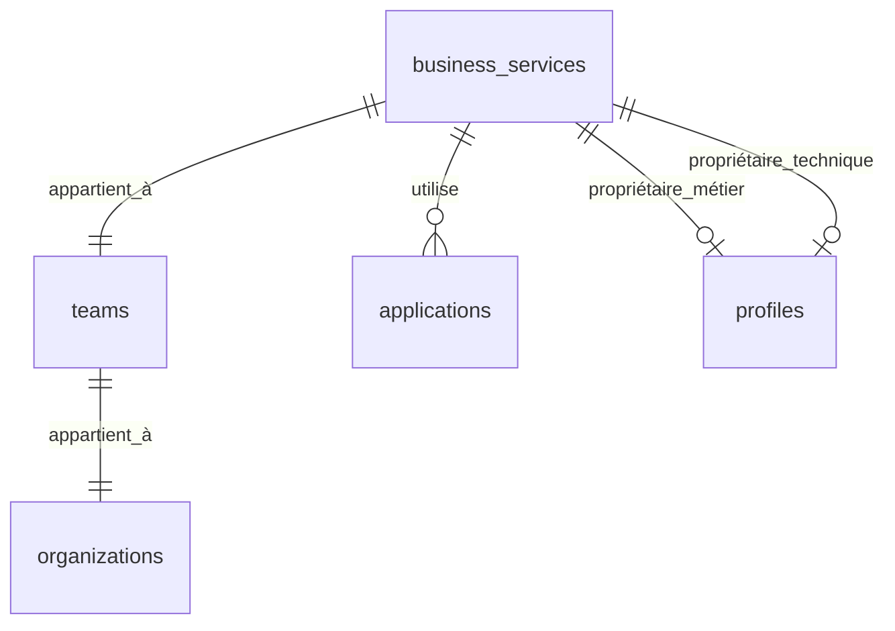

# 🏢 Guide des Services Métiers - Plateforme MSP

## 📋 Vue d'ensemble

Le module de **Gestion des Services Métiers** permet aux organisations de définir, organiser et superviser leurs services business, en établissant des liens avec les applications techniques et en assignant des responsabilités claires.

## 🎯 Objectifs

- **Cartographie des services** : Inventaire complet des services business
- **Gestion de la criticité** : Classification et priorisation des services
- **Attribution des responsabilités** : Définition des propriétaires métier et technique
- **Liaison avec les applications** : Mapping service-application
- **Métriques et performance** : Suivi des SLA et indicateurs clés

---

## 🚀 Fonctionnalités principales

### 1. **Création et gestion des services**
- ✅ Formulaire complet avec validation
- ✅ Gestion des niveaux de criticité (Faible, Moyenne, Élevée, Critique)
- ✅ Niveaux de service (Bronze, Silver, Gold, Platinum)
- ✅ Description détaillée et métadonnées

### 2. **Propriétaires et responsabilités**
- ✅ **Propriétaire métier** : Responsable du business
- ✅ **Propriétaire technique** : Responsable de l'implémentation
- ✅ Assignation par équipe et utilisateur
- ✅ Profils de contact automatiques

### 3. **Stack technique et applicative**
- ✅ **Stack technique** : Technologies utilisées (React, Node.js, PostgreSQL...)
- ✅ **Stack applicative** : Composants business (API, Base de données, Cache...)
- ✅ Tags prédéfinis et personnalisables
- ✅ Gestion par badges

### 4. **Liaisons avec les applications**
- ✅ Mapping automatique service ↔ applications
- ✅ Vue consolidée des dépendances
- ✅ Liens vers documentation et repos

### 5. **Dashboard et analytiques**
- ✅ **Métriques globales** : Total services, criticité, couverture
- ✅ **Répartition par criticité** : Graphiques et pourcentages
- ✅ **Couverture applicative** : Services avec/sans applications
- ✅ **Conformité SLA** : Suivi des performances

---

## 🏗️ Architecture technique

### Structure des données

```typescript
interface BusinessService {
  id: string;
  name: string;                     // Nom du service
  description: string;              // Description détaillée
  criticality: 'low' | 'medium' | 'high' | 'critical';
  service_level: string;            // bronze, silver, gold, platinum
  team_id: string;                  // Équipe propriétaire
  business_owner: string;           // UUID du propriétaire métier
  technical_owner: string;          // UUID du propriétaire technique
  application_stack: string[];     // Composants applicatifs
  technical_stack: string[];       // Technologies utilisées
  metadata: Record<string, any>;   // Informations supplémentaires
}
```

### Relations base de données



---

## 📱 Guide d'utilisation

### 1. **Accéder aux Services Métiers**
```
Navigation → Applications → Services Métiers
URL: /applications/business-services
```

### 2. **Créer un nouveau service**

#### Étape 1 : Informations de base
- **Nom** : Nom explicite du service (ex: "Service de facturation")
- **Description** : Description détaillée du service
- **Criticité** : Impact sur le business
  - 🟢 **Faible** : Service non critique
  - 🟡 **Moyenne** : Service important
  - 🟠 **Élevée** : Service critique pour certaines fonctions
  - 🔴 **Critique** : Service essentiel au business
- **Niveau de service** : Bronze, Silver, Gold, Platinum

#### Étape 2 : Propriétaires
- **Propriétaire métier** : Responsable business du service
- **Équipe métier** : Équipe de rattachement
- **Propriétaire technique** : Responsable technique
- **Équipe technique** : Équipe de développement/maintenance

#### Étape 3 : Stack technique
- **Technologies** : Langages, frameworks, outils (React, Node.js, PostgreSQL...)
- **Composants** : Éléments applicatifs (API, Database, Cache, Authentication...)
- Utilisation des **tags prédéfinis** ou **personnalisés**

#### Étape 4 : Métadonnées
- **Format JSON** pour informations supplémentaires
- Exemples : environnement, centre de coût, contacts...

### 3. **Visualiser un service**

#### Vue d'ensemble
- 📊 **Informations générales** : Criticité, niveau, équipe
- 👥 **Propriétaires** : Contacts métier et technique
- 📈 **Métriques** : Disponibilité, temps de réponse, SLA

#### Applications liées
- 📦 **Liste des applications** utilisant ce service
- 🔗 **Liens directs** vers repos et documentation
- 📊 **Stack technique** de chaque application

#### Stack et technologies
- 🔧 **Technologies utilisées** : Badges par technologie
- 🏗️ **Composants applicatifs** : Architecture du service
- 📋 **Métadonnées** : Informations complémentaires

---

## 📊 Dashboard et métriques

### Métriques principales

| Métrique | Description | Objectif |
|----------|-------------|----------|
| **Services totaux** | Nombre total de services | Croissance continue |
| **Services critiques** | Nombre de services critique/élevé | Surveillance renforcée |
| **Couverture apps** | % services avec applications | 80% minimum |
| **Conformité SLA** | % services conformes | 95% minimum |

### Répartitions

#### Par criticité
- 🟢 **Faible** : Services non critiques
- 🟡 **Moyenne** : Services standards  
- 🟠 **Élevée** : Services importants
- 🔴 **Critique** : Services essentiels

#### Par équipe
- Distribution des services par équipe
- Identification des équipes surchargées
- Équilibrage des responsabilités

#### Couverture applicative
- **Avec applications** : Services mappés
- **Sans applications** : Services à documenter
- **Objectif** : 100% de couverture

---

## 🔧 Bonnes pratiques

### 1. **Nommage des services**
```
✅ Service de facturation
✅ Authentification utilisateur
✅ Gestion des commandes

❌ Service1
❌ App principale
❌ Système
```

### 2. **Gestion de la criticité**
- **Critique** : Arrêt = impact business majeur
- **Élevée** : Dégradation significative du business
- **Moyenne** : Impact modéré, contournement possible
- **Faible** : Impact minimal, fonctionnalité secondaire

### 3. **Attribution des propriétaires**
- **Propriétaire métier** : Connaissance business, décisions fonctionnelles
- **Propriétaire technique** : Expertise technique, maintenance
- **Une personne identifiée** : Responsabilité claire
- **Équipe de backup** : Continuité de service

### 4. **Documentation de la stack**
- **Exhaustive** : Toutes les technologies utilisées
- **Précise** : Versions et spécificités
- **Maintenue** : Mise à jour régulière
- **Standardisée** : Utilisation des tags communs

### 5. **Liaison avec les applications**
- **Mapping complet** : Tous les services ont des applications
- **Bidirectionnel** : Service ↔ Application
- **Documentation** : Liens vers repos et docs
- **Maintenance** : Révision périodique

---

## 🎨 Personnalisation

### 1. **Niveaux de service personnalisés**
```typescript
// Dans le formulaire
const SERVICE_LEVEL_OPTIONS = [
  { value: 'basic', label: 'Basic', description: 'Service de base' },
  { value: 'standard', label: 'Standard', description: 'Service standard' },
  { value: 'premium', label: 'Premium', description: 'Service premium' },
  { value: 'enterprise', label: 'Enterprise', description: 'Service enterprise' }
];
```

### 2. **Stack technique personnalisée**
```typescript
// Technologies spécifiques à votre organisation
const CUSTOM_TECH_STACK = [
  'Votre Framework', 'Outil Interne', 'API Propriétaire'
];
```

### 3. **Métadonnées organisationnelles**
```json
{
  "environment": "production",
  "cost_center": "IT001",
  "business_unit": "Finance",
  "compliance": ["GDPR", "SOX"],
  "backup_strategy": "daily",
  "disaster_recovery": "4h RTO"
}
```

---

## 🔒 Sécurité et permissions

### Contrôle d'accès
- **MSP Admin** : Accès complet tous services
- **Manager équipe** : Services de son équipe
- **Utilisateur** : Lecture services publics
- **Propriétaire** : Modification services assignés

### RLS (Row Level Security)
```sql
-- Politique d'accès par équipe
CREATE POLICY "business_services_team_access" 
ON business_services FOR ALL 
USING (team_id = current_user_team_id());
```

---

## 🚀 Évolutions futures

### Phase 2 : Monitoring avancé
- 📈 **Métriques temps réel** : APM integration
- 🚨 **Alerting automatique** : Seuils SLA
- 📊 **Dashboards personnalisés** : Grafana integration

### Phase 3 : Automatisation
- 🔄 **Discovery automatique** : Scan infrastructure
- 🔗 **Mapping automatique** : Service ↔ Apps
- 📝 **Documentation auto** : Génération depuis code

### Phase 4 : Intelligence
- 🤖 **IA pour la classification** : Auto-criticité
- 📊 **Analytics prédictives** : Prévision pannes
- 🎯 **Recommandations** : Optimisation architecture

---

## 📞 Support

### Documentation technique
- **Types TypeScript** : `src/types/businessService.ts`
- **Hook principal** : `src/hooks/useBusinessServices.ts`
- **Composants** : `src/components/business-services/`

### Contact
- **Équipe MSP** : Support technique
- **Documentation** : Wiki interne
- **Formation** : Sessions dédiées

---

## 🎉 Conclusion

Le système de **Gestion des Services Métiers** fournit une vue complète et structurée de votre architecture business, permettant :

- ✅ **Visibilité totale** sur les services de l'organisation
- ✅ **Responsabilisation claire** des équipes et individus  
- ✅ **Suivi des performances** et conformité SLA
- ✅ **Aide à la décision** pour les évolutions techniques
- ✅ **Documentation centralisée** de l'architecture

**Prêt à cartographier vos services métiers ? Commencez dès maintenant !** 🚀 