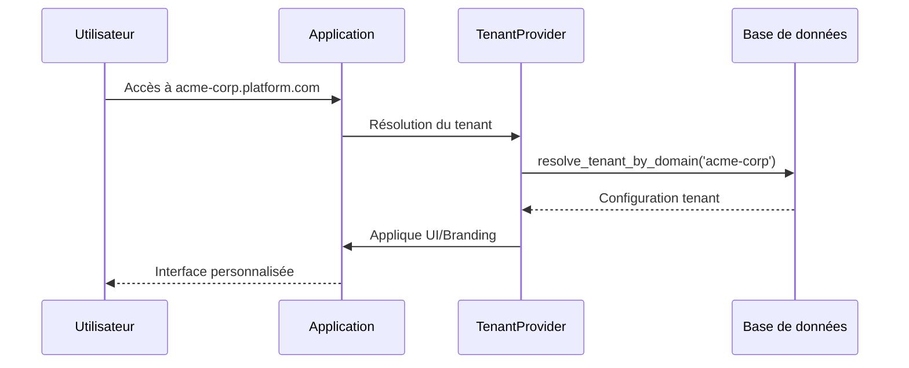

# Guide Multi-Tenant : URL Personnalisées par ESN et Clients

## 🎯 Vue d'ensemble

Ce système permet aux **administrateurs MSP** de créer des **URL personnalisées** pour chaque ESN et leurs clients, offrant une expérience de marque personnalisée pour chaque organisation.

### Fonctionnalités principales

✅ **URL personnalisées par tenant** : `acme-corp.platform.com`, `esn-alpha.myapp.fr`  
✅ **Branding personnalisé** : Logo, couleurs, nom d'entreprise  
✅ **Configuration UI adaptée** : Sidebar, thème, modules accessibles  
✅ **Gestion des accès granulaire** : Contrôle des modules par organisation  
✅ **Interface d'administration** : Gestion centralisée par les admins MSP  

---

## 🏗️ Architecture du système

### 1. Tables de base de données

#### `tenant_domains`
```sql
- id : UUID primaire
- domain_name : Nom court (ex: "acme-corp")
- full_url : URL complète (ex: "acme-corp.platform.com")
- organization_id : Organisation associée
- tenant_type : 'esn' | 'client' | 'msp'
- branding : Configuration de marque (JSON)
- ui_config : Configuration de l'interface (JSON)
- is_active : Statut du domaine
```

#### `tenant_access_config`
```sql
- tenant_domain_id : Référence au domaine
- organization_id : Organisation ayant accès
- access_type : 'full' | 'limited' | 'readonly'
- allowed_modules : Modules accessibles (JSON)
- access_restrictions : Restrictions spécifiques (JSON)
```

### 2. Flux de résolution de tenant



---

## 🚀 Guide d'utilisation

### Pour les administrateurs MSP

#### 1. Accéder à la gestion des domaines
- Naviguer vers **Paramètres > Gestion des domaines** (`/tenant-management`)
- Cette section est réservée aux administrateurs MSP

#### 2. Créer un nouveau domaine tenant

1. **Cliquer sur "Nouveau domaine"**
2. **Configuration de base :**
   - **Nom de domaine** : `acme-corp` (nom court)
   - **URL complète** : `acme-corp.platform.com` (auto-générée si vide)
   - **Organisation** : Sélectionner l'organisation cible
   - **Type de tenant** : ESN, Client ou MSP

3. **Configuration du branding :**
   - **Nom de l'entreprise** : "ACME Corporation"
   - **Logo** : URL vers le logo de l'entreprise
   - **Couleurs** : Couleurs primaire et secondaire
   - **CSS personnalisé** : Styles additionnels

4. **Configuration de l'interface :**
   - **Couleurs UI** : Couleurs pour l'interface
   - **Style de sidebar** : Classique, Moderne, Minimal
   - **Thème par défaut** : Clair, Sombre, Automatique
   - **Sélecteur d'organisation** : Activer/désactiver

#### 3. Gérer les domaines existants

| Action | Description |
|--------|-------------|
| 👁️ **Prévisualiser** | Ouvre l'URL dans un nouvel onglet |
| ✏️ **Modifier** | Édite la configuration du domaine |
| 👁️‍🗨️ **Activer/Désactiver** | Active ou désactive le domaine |
| 🗑️ **Supprimer** | Supprime définitivement le domaine |

### Pour les utilisateurs finaux

#### Accès via URL personnalisée
1. **URL reçue** : `https://acme-corp.platform.com`
2. **Résolution automatique** : L'application détecte le tenant
3. **Interface personnalisée** : Logo, couleurs et nom de l'entreprise appliqués
4. **Modules filtrés** : Seuls les modules autorisés sont accessibles

---

## 🎨 Personnalisation de l'interface

### Configuration du branding

```json
{
  "company_name": "ACME Corporation",
  "logo": "https://acme-corp.com/logo.png",
  "primary_color": "#1e40af",
  "secondary_color": "#3b82f6",
  "custom_css": "/* CSS personnalisé */"
}
```

### Configuration de l'UI

```json
{
  "primary_color": "#1e40af",
  "secondary_color": "#3b82f6",
  "sidebar_style": "modern",
  "theme": "auto",
  "show_organization_switcher": true
}
```

### Modules disponibles

- `organizations` - Gestion des organisations
- `users` - Gestion des utilisateurs
- `teams` - Gestion des équipes
- `itsm` - Outils ITSM
- `cloud` - Infrastructure cloud
- `security` - Sécurité
- `monitoring` - Supervision
- `admin` - Administration

---

## 🔧 Configuration technique

### 1. DNS et domaines

#### Sous-domaines automatiques
```
acme-corp.platform.com → Configuration automatique
client-beta.platform.com → Configuration automatique
```

#### Domaines personnalisés
```
acme.mycompany.com → Configuration DNS requise
→ CNAME vers platform.com
```

### 2. Variables d'environnement

```bash
# URL de base pour les sous-domaines
VITE_APP_BASE_DOMAIN=platform.com

# Support des domaines personnalisés
VITE_TENANT_CUSTOM_DOMAINS=true
```

### 3. Configuration de développement

#### Hosts locaux pour les tests
```bash
# /etc/hosts
127.0.0.1 acme-corp.localhost
127.0.0.1 esn-alpha.localhost
127.0.0.1 client-beta.localhost
```

#### URLs de test
```
http://acme-corp.localhost:8080
http://esn-alpha.localhost:8080
http://client-beta.localhost:8080
```

---

## 📊 Exemples d'utilisation

### Cas d'usage 1 : ESN avec plusieurs clients

```
🏢 ESN Alpha (esn-alpha.platform.com)
├── 🏢 Client A (client-a.platform.com)
├── 🏢 Client B (client-b.platform.com)
└── 🏢 Client C (client-c.platform.com)
```

**Configuration :**
- ESN Alpha : Accès complet aux outils de gestion
- Clients : Accès limité à leurs données uniquement

### Cas d'usage 2 : Client avec branding complet

```
🏢 ACME Corp (acme-corp.platform.com)
├── 🎨 Logo personnalisé
├── 🎨 Couleurs de marque
├── 🎨 Nom d'entreprise
└── 📱 Modules : ITSM, Cloud, Monitoring
```

### Cas d'usage 3 : MSP avec domaine administratif

```
🏢 MSP Admin (admin.platform.com)
├── 👥 Gestion des organisations
├── 🌐 Gestion des domaines tenant
├── ⚙️ Configuration globale
└── 📊 Supervision générale
```

---

## 🔒 Sécurité et permissions

### Contrôle d'accès par tenant

1. **Résolution de tenant** : Basée sur l'URL d'accès
2. **Vérification des permissions** : Organisation autorisée pour ce tenant
3. **Filtrage des modules** : Selon la configuration d'accès
4. **Isolation des données** : RLS au niveau base de données

### Politiques RLS

```sql
-- Accès aux domaines tenant
CREATE POLICY "tenant_domains_access" ON tenant_domains
FOR ALL USING (
  is_msp_admin() OR 
  organization_id IN (SELECT organization_id FROM organization_memberships WHERE user_id = auth.uid())
);
```

---

## 🛠️ Maintenance et monitoring

### Logs et surveillance

```typescript
// Résolution de tenant
console.log('Tenant résolu:', {
  domain: tenant.domain_name,
  organization: tenant.organization_id,
  type: tenant.tenant_type
});

// Erreurs de résolution
console.error('Erreur résolution tenant:', error);
```

### Métriques importantes

- **Taux de résolution** : % de domaines résolus avec succès
- **Temps de réponse** : Latence de résolution de tenant
- **Utilisation par tenant** : Statistiques d'accès par domaine
- **Erreurs 404** : Domaines non trouvés

---

## 🔄 Migration et déploiement

### 1. Appliquer la migration

```bash
# Exécuter la migration dans Supabase
supabase db push

# Ou appliquer manuellement
psql -f supabase/migrations/20250101000000_tenant_domains.sql
```

### 2. Configurer les premiers domaines

```sql
-- Exemple d'insertion de domaine
INSERT INTO tenant_domains (
  domain_name, full_url, organization_id, tenant_type,
  branding, ui_config, created_by
) VALUES (
  'acme-corp',
  'acme-corp.platform.com',
  'org-uuid-here',
  'client',
  '{"company_name": "ACME Corp", "logo": "https://acme.com/logo.png"}',
  '{"primary_color": "#1e40af", "sidebar_style": "modern"}',
  'user-uuid-here'
);
```

### 3. Tests de validation

- ✅ Résolution de tenant par domaine
- ✅ Application du branding personnalisé
- ✅ Filtrage des modules selon les permissions
- ✅ URLs de preview fonctionnelles
- ✅ Interface d'administration accessible

---

## 🆘 Dépannage

### Problèmes courants

#### Domaine non résolu
```typescript
// Vérifier dans la console
const tenant = await TenantService.resolveTenantFromCurrentURL();
console.log('Tenant trouvé:', tenant);
```

#### Branding non appliqué
```typescript
// Vérifier la configuration UI
const { currentTenant } = useTenant();
console.log('Configuration UI:', currentTenant?.ui_config);
```

#### Permissions d'accès
```typescript
// Vérifier les permissions d'accès
const { hasAccess } = useTenantAccess();
console.log('Accès autorisé:', hasAccess);
```

### Commandes utiles

```sql
-- Lister tous les domaines tenant
SELECT * FROM tenant_domains WHERE is_active = true;

-- Vérifier la configuration d'accès
SELECT * FROM tenant_access_config WHERE tenant_domain_id = 'tenant-uuid';

-- Résoudre un domaine manuellement
SELECT * FROM resolve_tenant_by_domain('acme-corp');
```

---

## 🎉 Conclusion

Le système multi-tenant offre une **solution complète** pour personnaliser l'expérience de chaque ESN et client avec :

- **URL personnalisées** pour un accès direct et branded
- **Interface adaptée** avec branding et configuration UI
- **Gestion centralisée** par les administrateurs MSP
- **Sécurité robuste** avec contrôle d'accès granulaire

Les administrateurs MSP peuvent maintenant créer facilement des environnements personnalisés pour leurs clients tout en gardant un contrôle centralisé sur l'ensemble de la plateforme.

---

**📞 Support technique** : Contactez l'équipe de développement pour toute question ou assistance lors de la mise en place. 