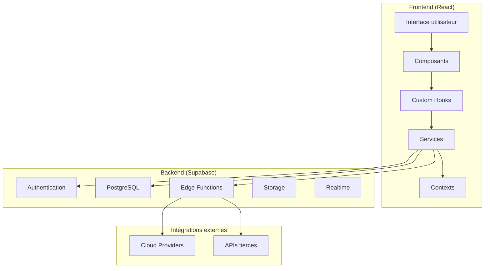
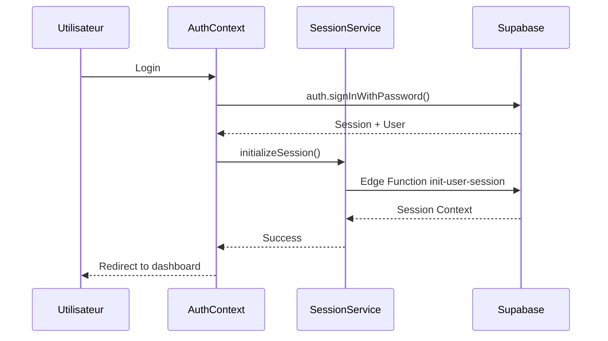
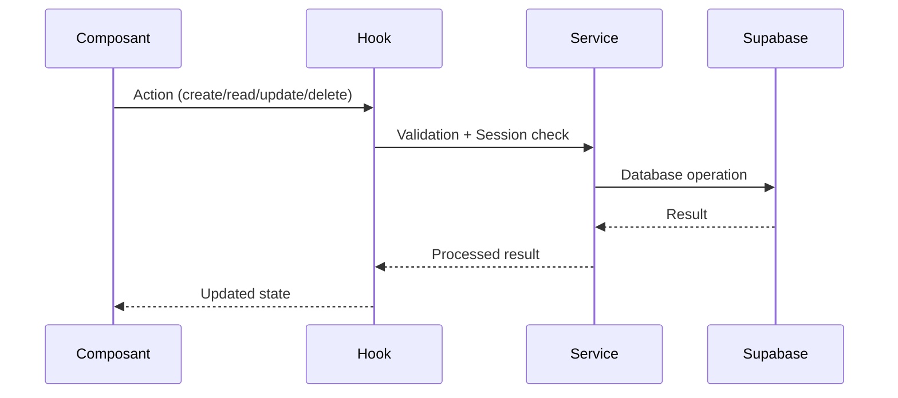
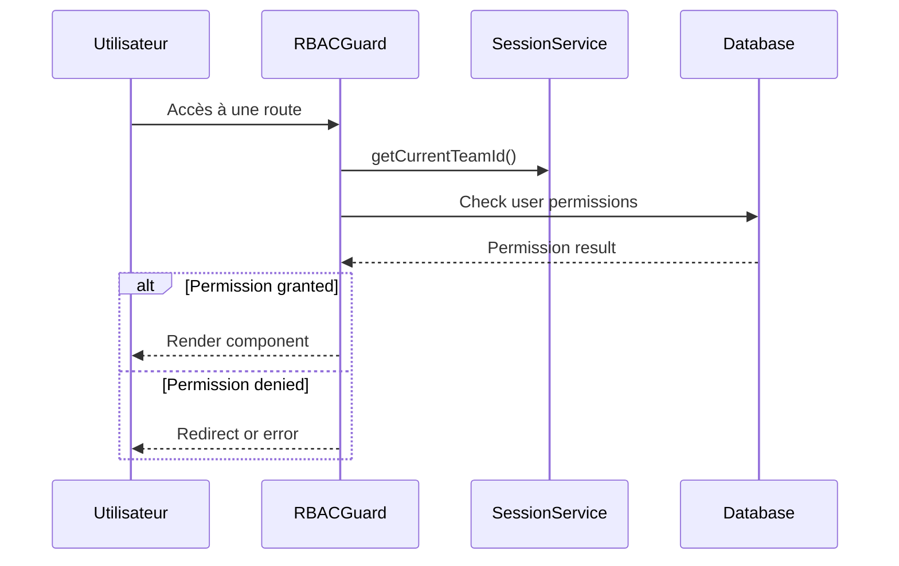

# Architecture de la Plateforme MSP

## Vue d'ensemble de l'architecture

La plateforme MSP suit une architecture moderne basée sur React avec une approche service-oriented et une séparation claire des responsabilités.

## 🏗️ Architecture globale



## 📁 Structure des dossiers détaillée

### `/src/components`

#### `common/` - Composants métier réutilisables
- **ActionButtons**: Boutons d'actions standardisés
- **ActionCard**: Cartes d'actions avec métrique
- **CRUDTable**: Table générique avec CRUD
- **DataGrid**: Grille de données responsive
- **PageHeader**: En-tête de page standardisé
- **SearchAndFilters**: Composants de recherche et filtrage

#### `forms/` - Formulaires spécialisés
- **OrganizationForm**: Création/édition d'organisations
- **TeamForm**: Gestion des équipes
- **UserForm**: Gestion des utilisateurs
- **ServiceRequestForm**: Demandes de service ITSM

#### `layout/` - Composants de mise en page
- **AppLayout**: Layout principal de l'application
- **AppSidebar**: Navigation latérale dynamique
- **NotificationCenter**: Centre de notifications
- **UserMenu**: Menu utilisateur

#### `itsm/` - Composants ITSM spécialisés
- **IncidentDetailView**: Vue détaillée des incidents
- **ServiceRequestDetailView**: Vue des demandes de service
- **CommentsSection**: Système de commentaires
- **QuickStatusUpdate**: Mise à jour rapide de statut

#### `rbac/` - Composants de gestion des permissions
- **RBACGuard**: Garde de route basé sur les permissions
- **PermissionManager**: Interface de gestion des permissions
- **UserRoleManager**: Gestion des rôles utilisateurs

### `/src/services` - Couche de services métier

#### `sessionService.ts` - Gestion centralisée des sessions
```typescript
class SessionService {
  // Singleton pattern
  private static instance: SessionService;
  
  // État de session
  private sessionContext: SessionContext | null = null;
  private userProfile: UserProfile | null = null;
  
  // Méthodes principales
  async initializeSession(orgId?: string, teamId?: string): Promise<boolean>
  clearSession(): void
  getCurrentTeamId(): string | null
  isMspAdmin(): boolean
  switchContext(orgId: string, teamId: string): Promise<boolean>
}
```

#### `cloudService.ts` - Services cloud
```typescript
class CloudService {
  async getAssets(): Promise<CloudAssetWithProvider[]>
  async getProviders(): Promise<CloudProvider[]>
  async refreshInventory(providerId?: string): Promise<string[]>
  async saveCredentials(providerId: string, config: Record<string, any>): Promise<CloudCredentials>
}
```

### `/src/hooks` - Custom Hooks

#### Hooks de données
- **useSession**: Hook principal de gestion de session
- **useCloudOrchestration**: Gestion des opérations cloud
- **useNotifications**: Système de notifications
- **useITSMCrud**: CRUD pour les entités ITSM
- **useRBAC**: Gestion des permissions et rôles

#### Pattern des hooks
```typescript
export const useSession = () => {
  const [sessionContext, setSessionContext] = useState<SessionContext | null>(null);
  
  // Subscription au service
  useEffect(() => {
    const unsubscribe = sessionService.subscribe(setSessionContext);
    return unsubscribe;
  }, []);
  
  return {
    sessionContext,
    hasValidContext: sessionService.hasValidContext(),
    initializeSession: sessionService.initializeSession,
    // ...autres méthodes
  };
};
```

### `/src/contexts` - Contextes React

#### `AuthContext.tsx` - Contexte d'authentification
- Gestion de l'état d'authentification Supabase
- Intégration avec sessionService
- Gestion des événements auth (login, logout, refresh)

## 🔄 Flux de données

### 1. Authentification et initialisation


### 2. Opérations CRUD


### 3. Gestion des permissions


## 🗄️ Architecture base de données

### Schéma principal

#### **Organisations et utilisateurs**
```sql
-- Organisations (MSP, clients, ESN)
organizations: id, name, type, is_msp, metadata

-- Équipes au sein des organisations  
teams: id, name, organization_id, description

-- Profils utilisateurs
profiles: id, email, first_name, last_name, is_msp_admin

-- Relations MSP-Client
msp_client_relations: msp_org_id, client_org_id, esn_org_id
```

#### **Système RBAC**
```sql
-- Rôles du système
roles: id, name, display_name, is_system_role

-- Permissions granulaires
permissions: id, name, resource, action

-- Association rôles-permissions
role_permissions: role_id, permission_id

-- Attribution des rôles aux utilisateurs
user_roles: user_id, role_id, organization_id, team_id
```

#### **ITSM**
```sql
-- Incidents
itsm_incidents: id, title, description, status, priority, team_id

-- Demandes de changement
itsm_change_requests: id, title, change_type, status, team_id

-- Demandes de service
itsm_service_requests: id, title, service_category, status, team_id

-- Commentaires unifiés
itsm_comments: id, content, incident_id, change_request_id
```

#### **Infrastructure Cloud**
```sql
-- Fournisseurs cloud
cloud_providers: id, name, display_name, api_endpoint

-- Credentials par équipe
cloud_credentials: id, team_id, provider_id, config

-- Assets cloud inventoriés
cloud_asset: id, team_id, provider_id, asset_type, metadata

-- Exécutions de tâches
backup_executions: id, team_id, provider_id, task_type, status
```

### Row Level Security (RLS)

Chaque table a des politiques RLS pour garantir l'isolation des données :

```sql
-- Exemple pour cloud_asset
CREATE POLICY "cloud_asset_access_policy" ON cloud_asset
FOR ALL USING (
  is_msp_admin() OR 
  team_id = current_setting('app.current_team')::uuid
);
```

## 🔧 Edge Functions (Supabase)

### `init-user-session`
- Initialise le contexte de session utilisateur
- Définit les variables PostgreSQL de session
- Gère les permissions MSP vs équipe

### `cloud-orchestration`
- Orchestration des tâches cloud
- Inventaire automatisé
- Gestion des sauvegardes

### `notification-dispatcher`
- Envoi de notifications multi-canal
- Gestion des templates
- Queue de traitement

## 🎨 Architecture UI

### Design System
- **Tokens CSS** : Variables cohérentes pour couleurs, espacements, typographie
- **Composants de base** : shadcn/ui comme fondation
- **Composants métier** : Couche d'abstraction pour les besoins spécifiques

### Responsive Design
- Mobile-first approach
- Breakpoints Tailwind standard
- Sidebar adaptative (collapse sur mobile)

### Thème et personnalisation
- Support dark/light mode automatique
- Tokens CSS custom properties
- Configuration par équipe/organisation

## 🔐 Sécurité

### Frontend
- Validation des données avec Zod
- Protection des routes avec RBAC
- Sanitization des inputs

### Backend (Supabase)
- Row Level Security sur toutes les tables
- Functions SECURITY DEFINER
- Validation des permissions côté serveur

### Communication
- HTTPS obligatoire
- Tokens JWT avec expiration
- Rate limiting sur les Edge Functions

## 📊 Performance

### Frontend
- Code splitting par route
- Lazy loading des composants
- Memoization avec React.memo/useMemo

### Backend
- Index optimisés sur les requêtes fréquentes
- Pagination automatique
- Cache intelligent côté client

### Monitoring
- Métriques de performance intégrées
- Logging centralisé
- Alertes automatiques

## 🔄 État et synchronisation

### État local
- React state pour l'UI éphémère
- Custom hooks pour l'état métier
- Context pour l'état global (auth, session)

### Synchronisation temps réel
- Supabase Realtime pour les updates
- Optimistic updates côté client
- Réconciliation automatique

Cette architecture garantit la scalabilité, la maintenabilité et la sécurité de la plateforme MSP.