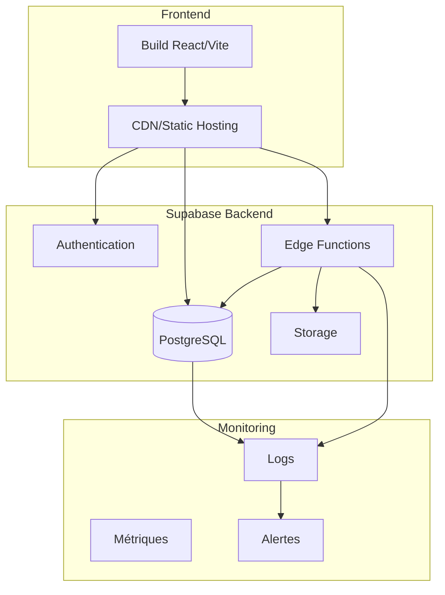

# Guide de déploiement

## 🚀 Vue d'ensemble

Ce guide couvre le déploiement de la plateforme MSP depuis l'environnement de développement jusqu'à la production, incluant la configuration de Supabase et les bonnes pratiques de sécurité.

## 🏗️ Architecture de déploiement



## 🔧 Configuration Supabase

### 1. Création du projet Supabase

```bash
# Installer Supabase CLI
npm install -g supabase

# Initialiser le projet
supabase init

# Lier au projet distant
supabase link --project-ref your-project-ref
```

### 2. Configuration des variables d'environnement

```env
# Production
VITE_SUPABASE_URL=https://your-project.supabase.co
VITE_SUPABASE_ANON_KEY=your-anon-key

# Optionnel pour le développement
SUPABASE_SERVICE_ROLE_KEY=your-service-role-key
```

### 3. Déploiement de la base de données

```bash
# Appliquer les migrations
supabase db push

# Ou déployer depuis les fichiers de migration
supabase migration up
```

### 4. Configuration de l'authentification

#### URLs de redirection
Dans le dashboard Supabase > Authentication > URL Configuration :

```
Site URL: https://your-domain.com
Redirect URLs: 
  - https://your-domain.com/**
  - http://localhost:3000/** (pour le dev)
```

#### Providers d'authentification
```sql
-- Configurer les providers (si nécessaire)
-- Email/Password est activé par défaut
```

### 5. Déploiement des Edge Functions

```bash
# Déployer toutes les functions
supabase functions deploy

# Déployer une function spécifique
supabase functions deploy init-user-session

# Configurer les secrets
supabase secrets set --env-file .env.production
```

### 6. Configuration des politiques RLS

Vérifier que toutes les politiques sont actives :

```sql
-- Vérifier les politiques actives
SELECT schemaname, tablename, policyname, permissive, roles, cmd, qual 
FROM pg_policies 
WHERE schemaname = 'public';

-- Activer RLS sur une table si nécessaire
ALTER TABLE public.organizations ENABLE ROW LEVEL SECURITY;
```

## 📦 Build et déploiement Frontend

### 1. Build de production

```bash
# Install des dépendances
npm ci

# Type checking
npm run type-check

# Linting
npm run lint

# Build
npm run build

# Le dossier dist/ contient les fichiers à déployer
```

### 2. Variables d'environnement de build

```env
# .env.production
VITE_SUPABASE_URL=https://your-project.supabase.co
VITE_SUPABASE_ANON_KEY=your-production-anon-key
VITE_APP_VERSION=1.0.0
VITE_ENVIRONMENT=production
```

### 3. Options de déploiement

#### Option A: Vercel
```bash
# Installation
npm i -g vercel

# Déploiement
vercel --prod

# Configuration automatique pour Vite
```

```json
// vercel.json
{
  "framework": "vite",
  "buildCommand": "npm run build",
  "outputDirectory": "dist",
  "env": {
    "VITE_SUPABASE_URL": "@supabase_url",
    "VITE_SUPABASE_ANON_KEY": "@supabase_anon_key"
  }
}
```

#### Option B: Netlify
```bash
# Netlify CLI
npm i -g netlify-cli

# Déploiement
netlify deploy --prod --dir=dist
```

```toml
# netlify.toml
[build]
  command = "npm run build"
  publish = "dist"

[[env]]
  VITE_SUPABASE_URL = "https://your-project.supabase.co"
  VITE_SUPABASE_ANON_KEY = "your-anon-key"
```

#### Option C: Firebase Hosting
```bash
# Firebase CLI
npm install -g firebase-tools

# Initialisation
firebase init hosting

# Déploiement
firebase deploy --only hosting
```

#### Option D: AWS S3 + CloudFront
```bash
# Build
npm run build

# Sync vers S3
aws s3 sync dist/ s3://your-bucket-name --delete

# Invalider CloudFront
aws cloudfront create-invalidation --distribution-id E1234567890 --paths "/*"
```

## 🔐 Configuration de sécurité

### 1. HTTPS et domaines

```bash
# Configurer HTTPS obligatoire
# Ajouter les headers de sécurité
```

#### Headers de sécurité recommandés
```
Content-Security-Policy: default-src 'self' https://*.supabase.co; script-src 'self' 'unsafe-inline'; style-src 'self' 'unsafe-inline'
Strict-Transport-Security: max-age=31536000; includeSubDomains
X-Content-Type-Options: nosniff
X-Frame-Options: DENY
X-XSS-Protection: 1; mode=block
```

### 2. Configuration Supabase de production

#### Rate limiting
```sql
-- Configuration dans Supabase Dashboard
-- API Rate Limits: 100 req/min par IP
-- Auth Rate Limits: 10 req/min pour login
```

#### CORS et domaines autorisés
```
Allowed Origins:
- https://your-domain.com
- https://www.your-domain.com
```

### 3. Secrets et variables sensibles

```bash
# Edge Functions secrets
supabase secrets set SMTP_PASSWORD=your-smtp-password
supabase secrets set API_KEY=your-api-key
supabase secrets set WEBHOOK_SECRET=your-webhook-secret
```

## 📊 Monitoring et observabilité

### 1. Monitoring Supabase

#### Dashboard natif
- Métriques de base de données
- Utilisation des Edge Functions
- Logs d'authentification
- Métriques API

#### Configuration des alertes
```sql
-- Créer des alertes pour :
-- - Erreurs de connexion élevées
-- - Latence API > 1s
-- - Erreurs Edge Functions
-- - Utilisation disque > 80%
```

### 2. Monitoring application

#### Intégration avec des services externes

**Sentry pour les erreurs**
```typescript
// main.tsx
import * as Sentry from "@sentry/react";

Sentry.init({
  dsn: "your-sentry-dsn",
  environment: import.meta.env.VITE_ENVIRONMENT,
  tracesSampleRate: 0.1,
});
```

**Analytics avec Google Analytics**
```typescript
// utils/analytics.ts
import { gtag } from 'ga-gtag';

export const trackEvent = (action: string, category: string, label?: string) => {
  if (import.meta.env.PROD) {
    gtag('event', action, {
      event_category: category,
      event_label: label,
    });
  }
};
```

### 3. Logs et debugging

#### Logs Edge Functions
```typescript
// Dans une Edge Function
console.log('Info log', { userId, teamId });
console.error('Error log', { error: error.message, stack: error.stack });
```

#### Logs frontend
```typescript
// utils/logger.ts
export const logger = {
  info: (message: string, data?: any) => {
    if (import.meta.env.DEV) {
      console.log(`[INFO] ${message}`, data);
    }
    // Envoyer à un service de logging en production
  },
  error: (message: string, error?: any) => {
    console.error(`[ERROR] ${message}`, error);
    // Toujours logger les erreurs
  }
};
```

## 🔄 CI/CD Pipeline

### 1. GitHub Actions

```yaml
# .github/workflows/deploy.yml
name: Deploy to Production

on:
  push:
    branches: [main]

jobs:
  test:
    runs-on: ubuntu-latest
    steps:
      - uses: actions/checkout@v3
      - uses: actions/setup-node@v3
        with:
          node-version: '18'
      - run: npm ci
      - run: npm run type-check
      - run: npm run lint
      - run: npm run test

  deploy:
    needs: test
    runs-on: ubuntu-latest
    steps:
      - uses: actions/checkout@v3
      - uses: actions/setup-node@v3
        with:
          node-version: '18'
      - run: npm ci
      - run: npm run build
        env:
          VITE_SUPABASE_URL: ${{ secrets.VITE_SUPABASE_URL }}
          VITE_SUPABASE_ANON_KEY: ${{ secrets.VITE_SUPABASE_ANON_KEY }}
      
      # Déploiement Vercel
      - uses: amondnet/vercel-action@v25
        with:
          vercel-token: ${{ secrets.VERCEL_TOKEN }}
          vercel-org-id: ${{ secrets.ORG_ID }}
          vercel-project-id: ${{ secrets.PROJECT_ID }}
          vercel-args: '--prod'
```

### 2. Déploiement automatique Supabase

```yaml
# .github/workflows/supabase.yml
name: Deploy Supabase

on:
  push:
    branches: [main]
    paths: ['supabase/**']

jobs:
  deploy:
    runs-on: ubuntu-latest
    steps:
      - uses: actions/checkout@v3
      - uses: supabase/setup-cli@v1
        with:
          version: latest
      - run: supabase link --project-ref ${{ secrets.SUPABASE_PROJECT_ID }}
        env:
          SUPABASE_ACCESS_TOKEN: ${{ secrets.SUPABASE_ACCESS_TOKEN }}
      - run: supabase db push
      - run: supabase functions deploy
```

## 🗄️ Backup et récupération

### 1. Backup base de données

```bash
# Backup automatique Supabase (inclus dans l'abonnement Pro+)
# Backup manuel
supabase db dump --file backup.sql

# Restauration
supabase db reset --file backup.sql
```

### 2. Backup des Edge Functions

```bash
# Sauvegarder le code des functions
tar -czf functions-backup.tar.gz supabase/functions/

# Versioning via Git (recommandé)
git tag -a v1.0.0 -m "Production release v1.0.0"
git push origin v1.0.0
```

## 🔧 Configuration par environnement

### Développement
```env
VITE_SUPABASE_URL=http://localhost:54321
VITE_SUPABASE_ANON_KEY=local-anon-key
VITE_ENVIRONMENT=development
```

### Staging
```env
VITE_SUPABASE_URL=https://staging-project.supabase.co
VITE_SUPABASE_ANON_KEY=staging-anon-key
VITE_ENVIRONMENT=staging
```

### Production
```env
VITE_SUPABASE_URL=https://production-project.supabase.co
VITE_SUPABASE_ANON_KEY=production-anon-key
VITE_ENVIRONMENT=production
```

## 📋 Checklist de déploiement

### Pré-déploiement
- [ ] Tests unitaires passent
- [ ] Type checking OK
- [ ] Linting OK
- [ ] Variables d'environnement configurées
- [ ] Migrations DB testées
- [ ] Edge Functions testées

### Déploiement
- [ ] Build de production réussi
- [ ] Déploiement frontend OK
- [ ] Migrations DB appliquées
- [ ] Edge Functions déployées
- [ ] DNS et HTTPS configurés

### Post-déploiement
- [ ] Tests de fumée OK
- [ ] Monitoring actif
- [ ] Logs vérifiés
- [ ] Performances vérifiées
- [ ] Backup configuré

## 🚨 Gestion des incidents

### Rollback rapide
```bash
# Rollback Vercel
vercel rollback https://your-deployment-url.vercel.app

# Rollback Supabase (migrations)
supabase migration down

# Rollback Edge Functions
supabase functions deploy --legacy-version
```

### Monitoring d'incident
1. Vérifier les métriques Supabase
2. Consulter les logs d'erreur
3. Vérifier les alertes externes
4. Communiquer avec les utilisateurs
5. Appliquer le fix ou rollback

Ce guide assure un déploiement sécurisé et fiable de la plateforme MSP.